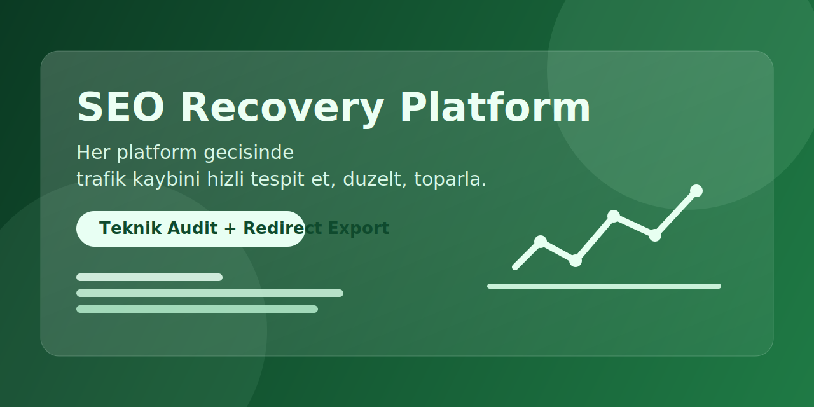

<p align="center">
  
</p>

<h1 align="center">SEO Recovery Platform</h1>
<p align="center">Migration Sonrasi Trafik Kaybini Gor, Duzelt, Toparla</p>

Ikas -> Shopify gibi platform gecislerinden sonra kaybolan SEO performansini hizli tespit etmek, aksiyona donusturmek ve toparlanmayi izlemek icin gelistirilmis FastAPI tabanli analiz uygulamasi.

## Neyi Cozer
- Eski ve yeni URL yapisini karsilastirir, otomatik eslestirme yapar.
- Shopify uyumlu `redirects.csv` uretir.
- Teknik SEO denetimi yapar: `404`, `5xx`, `noindex`, `canonical`, `robots.txt`, `sitemap.xml`.
- Site tarama modunda teknik dosyalari otomatik filtreler (`css/js/png/json/build/assets`).
- Her hata icin sebep ve uygulanabilir duzeltme adimlari verir.
- Canli analiz ilerlemesi, ETA (kalan sure) ve iptal akisi sunar.
- GSC Once/Sonra verisi ile:
  - 7/14/30 gunluk toparlanma paneli
  - "Duzeltildi ama toparlanmadi" URL listesi
  - Once/Sonra kiyas raporu ve `comparison.csv`

## Ozellikler
### 1) Gecis Karsilastirma Modu (CSV)
- `old_urls.csv` + `new_urls.csv` yuklenir.
- URL eslestirme skoru, kritik kayiplar ve export dosyalari uretilir.

### 2) Site Tarama Modu (Tek URL)
- Sadece domain girilir.
- Sitemap + ic link taramasi ile URL kesfi yapilir.
- Teknik SEO sorunlari onceliklendirilir.

### 3) Canli Operasyon Akisi
- Analiz adimlari canli izlenir.
- Kalan sure tahmini gorulur.
- Uzun analizlerde islem iptal edilebilir.

## Kurulum
```bash
cd seo-recovery-app
python -m venv .venv
.venv\Scripts\activate
pip install -r requirements.txt
```

## Calistirma
```bash
uvicorn app.main:app --host 127.0.0.1 --port 8000
```

Tarayici: `http://127.0.0.1:8000`

## Girdi Formatlari
### Zorunlu
- `old_urls.csv` -> `url` (opsiyonel `type`)
- `new_urls.csv` -> `url` (opsiyonel `type`)

### Opsiyonel
- `gsc_before_pages.csv` -> `url,clicks,impressions,position`
- `gsc_after_pages.csv` -> `url,clicks,impressions,position`
- `gsc_pages.csv` (geriye donuk destek)

## Ciktilar
- `redirects.csv`
- `manual_review.csv`
- `comparison.csv`
- Teknik denetim tablolari
- Duzeltme rehberi ve toparlanma panelleri

## Test
```bash
python -m unittest tests.test_golden
```

## Lisans
Bu proje MIT lisansi altinda dagitilmaktadir. Ayrinti icin `LICENSE` dosyasina bakiniz.
